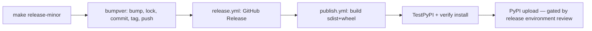

# Contributing to tidydraws

Welcome to the tidydraws project! We're excited that you're interested in contributing.
This document explains how to set up your development environment and contribute to this project.

## One-Time Setup

### Prerequisites
- Python 3.12 or higher
- [`uv`](https://github.com/astral-sh/uv) package manager

### Fork and clone

```bash
git clone https://github.com/YOUR_USERNAME/tidydraws.git
cd tidydraws
```

### Install dependencies

```bash
uv sync --all-extras
```

This installs all runtime and dev dependencies (pytest, ruff, mypy, great-docs, etc.) and optional plotting libraries.

### Install pre-commit hooks (optional but recommended)

```bash
uv run pre-commit install
```

## Starting a New Session

Each time you start a new development session, sync your environment to pick up any dependency changes:

```bash
uv sync --all-extras
```

Pre-commit hooks persist across sessions — no need to reinstall unless `.pre-commit-config.yaml` changes.

### Upgrading a single dependency

To update a specific package (e.g. `great-docs`) to its latest allowed version:

```bash
uv sync --all-extras --upgrade-package great-docs
```

The `--upgrade-package` flag updates the lock file resolution for that package only (respecting the version constraint in `pyproject.toml`). `--all-extras` is required because several dev dependencies — including `great-docs` — are listed under `[project.optional-dependencies] dev` rather than in the `[dependency-groups]` section, so a bare `uv sync` would resolve the upgrade but skip installing them.

To upgrade every dependency to the latest compatible version:

```bash
uv sync --all-extras --upgrade
```

To upgrade the lock file without touching `.venv` (e.g. to inspect what changed):

```bash
uv lock --upgrade-package great-docs
```

After upgrading, run `make install` (which wraps `uv sync --all-extras`) to install any newly resolved packages.

## Common Dev Commands

Run tests:
```bash
uv run pytest
```

Lint code:
```bash
uv run ruff check .
```

Type check:
```bash
uv run mypy .
```

## Documentation

We use [Great Docs](https://posit-dev.github.io/great-docs/) (which wraps Quarto) for the documentation site. A single `great-docs.yml` at the repo root controls the build: it wires up the API reference, the narrative tutorials under `docs/user_guide/`, and the worked examples under `docs/examples/`.

### Building Documentation Locally

1. Build the site (output goes to the ephemeral `great-docs/_site/` directory):
   ```bash
   uv run great-docs build      # or: make docs
   ```

2. Preview locally with live reload at http://localhost:3000:
   ```bash
   uv run great-docs preview    # or: make docs-preview
   ```

3. See what API symbols Great Docs can discover:
   ```bash
   uv run great-docs scan --verbose
   ```

The `great-docs/` directory is **ephemeral** — it is regenerated on every build and is git-ignored. Never edit files inside it directly; change `great-docs.yml` or the source `.qmd` files under `docs/` instead. To clear it, run `make cleandocs`.

### Agent skills for the docs

This repo ships the [Great Docs Agent Skills](https://posit-dev.github.io/great-docs/) under `.agents/skills/` (`great-docs`, `configure-site`, `write-user-guide`, `revise-docstrings`, `author-skills`), pinned via `skills-lock.json`. AI coding agents working on the docs pick these up automatically; you do not need to install anything. To refresh them against upstream, run `npx skills add https://posit-dev.github.io/great-docs/` from the repo root and commit the result.

## Making Changes

1. Create a feature branch from `main`:
   ```bash
   git checkout -b feature/your-feature-name
   ```

2. Make your changes following the project's coding style and maintain compatibility.

3. Add tests for your changes where appropriate.

4. Run all checks before committing:
   ```bash
   uv run pytest
   uv run ruff check .
   uv run mypy .
   ```

5. Commit your changes with a descriptive message.

6. Push to your fork and create a pull request.

## Pull Request Guidelines

- Reference relevant issues in your PR description
- Ensure all tests pass
- Add or update documentation as needed
- Keep changes focused and atomic

## Releasing

Releases are cut by a repo admin running a single `make` target. The version lives in one place — `tidydraws/__init__.py` (`__version__`) — and is read dynamically by hatchling at build time, so `pyproject.toml` never carries a version literal.

### To cut a release (admin only)

```bash
make release-patch   # 0.4.0 -> 0.4.1
make release-minor   # 0.4.0 -> 0.5.0
make release-major   # 0.4.0 -> 1.0.0
```

This runs `bumpver`, which:

1. Bumps `__version__` in `tidydraws/__init__.py` (the only version literal in the repo).
2. Runs `scripts/pre-bump.sh`, which re-derives `uv.lock` and stages it so the lockfile lands in the same commit.
3. Commits with message `Bump version 0.4.0 -> 0.5.0`.
4. Creates and pushes tag `0.5.0`.

The tag push then triggers the automated cascade:



The final PyPI upload runs in the `release` [environment](https://docs.github.com/en/actions/deployment/targeting-different-environments/using-environments-for-deployment), which requires admin approval in the Actions UI. Nothing reaches PyPI without that click.

### Permissions and gating

- **Admin direct-push to `main`**: `enforce_admins` is off, so admins can push the bump commit directly. Non-admin collaborators still need a PR.
- **Tag protection**: only admins can push version tags (e.g. `0.5.0`), so only admins can trigger a release.
- **PyPI environment**: the `release` environment requires admin review before upload.

Non-admin collaborators and external contributors cannot cut releases at any stage.
