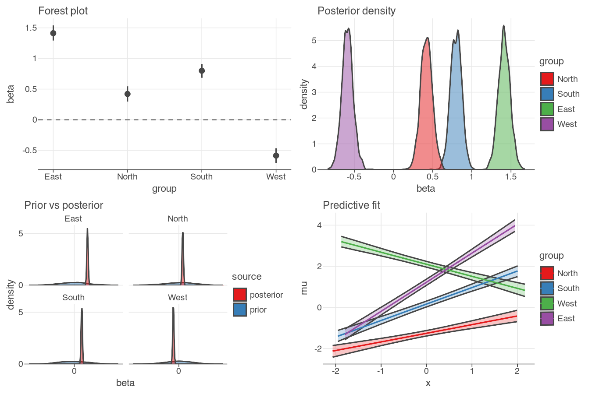

# tidydraws


> A tidybayes-inspired data layer for declarative Bayesian visualisation in Python

`tidydraws` turns MCMC output (ArviZ `DataTree`) into tidy Polars frames that are ready to plot — one `.to_pandas()` away from any ggplot-like backend. It does no plotting itself. Three functions, three spaces:

| Function | Space | Plot archetype |
| --- | --- | --- |
| [`parameter_draws()`](https://drbenvincent.github.io/tidydraws/docs/examples/parameter_draws.html) | parameter | density, forest, scatter |
| [`prediction_draws()`](https://drbenvincent.github.io/tidydraws/docs/examples/prediction_draws.html) | prediction | ribbon + line, fit + data |
| [`compare_draws()`](https://drbenvincent.github.io/tidydraws/docs/examples/compare_draws.html) | comparison | prior vs posterior, intervals |



## Install

With uv:
```bash
uv add tidydraws
```

With pip:
```bash
pip install tidydraws
```

If you want the latest functionality merged into main but not yet released, install directly from GitHub:

```bash
pip install git+https://github.com/drbenvincent/tidydraws.git
```

Or with uv:

```bash
uv add git+https://github.com/drbenvincent/tidydraws.git
```

## Why tidydraws?

Plotting MCMC output in Python means manually slicing xarray dimensions, iterating groups, and aligning coordinates — imperative, verbose, error-prone. R's [`tidybayes`](https://github.com/mjskay/tidybayes) solved this with a data layer that respects parameter space vs prediction space. `tidydraws` brings that to Python on Polars.

> **Backend-agnostic:** `tidydraws` returns Polars `DataFrame`s. Call `.to_pandas()` to bridge to lets-plot, plotnine, or any library that takes pandas. See the [examples](https://drbenvincent.github.io/tidydraws/docs/examples/parameter_draws.html) for both lets-plot and plotnine versions.

---

*Inspired by [tidybayes](https://github.com/mjskay/tidybayes) for R.*
